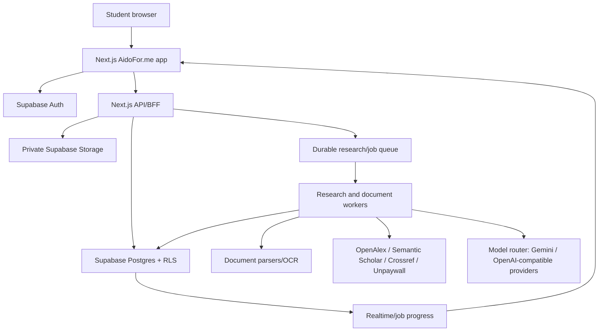

# AidoFor.me — Product Requirements Document

> **Product:** AidoFor.me, a TutorPakar product  
> **Launch hostname:** `aidoforme.tutorpakar.com`  
> **Optional future vanity domain:** `aidofor.me`  
> **Version:** 1.0  
> **Date:** 2026-07-19  
> **Status:** Research-backed product definition  
> **Owner:** TutorPakar  
> **Research scope:** Product workflow, academic-writing practice, competitor desk research, scholarly-data infrastructure, open-source options, academic integrity, privacy, and technical fit with the existing TutorPakar stack

### Companion architecture notes

- [Production Implementation Plan](./implementation-plan.md) — phased delivery gates, production-data rule, environment model, and the first real vertical slice.
- [Assignment Autopilot](./assignment-autopilot.md) — human-in-the-loop assignment completion, decision cards, durable checkpoints, and integrity-mode boundaries.
- [Credit Usage and Margin Control](./credit-usage-and-margin-control.md) — prepaid wallet, reservation/settlement pipeline, provider-cost ceilings, and loss controls.

---

## 1. Executive decision

AidoFor.me should be built as a **policy-aware, source-grounded academic writing workspace** for university and college students—not as a one-click essay generator.

The product's core promise is:

> **Turn a confusing assignment brief into a defensible, well-researched piece of writing in which every requirement is tracked, every important claim is connected to evidence, every citation can be opened and checked, and the student remains the author.**

The original proposed sequence—upload brief, research, outline, write, cite—is directionally correct but incomplete. A reliable academic workflow also needs:

1. institution and assignment AI-policy capture;
2. explicit brief and rubric confirmation;
3. research-question decomposition and search planning;
4. human source screening;
5. a claim-to-evidence ledger with exact supporting passages;
6. rubric-mapped outlining and section word budgets;
7. section-by-section drafting with student approval;
8. citation existence, metadata, and claim-support verification;
9. synthesis, counterargument, coherence, and source-quality review;
10. authorship history and an AI-use disclosure export.

The recommended MVP therefore makes **requirements, evidence, and provenance** structured product objects. Chat is the natural-language control layer, but it does not replace the workflow.

---

## 2. Why this workflow is the right one

### 2.1 Findings from academic-writing guidance

- Students commonly begin writing before they have correctly interpreted the assignment. Harvard's Writing Center recommends identifying the operative verbs—such as *analyze*, *compare*, *discuss*, *explain*, and *propose*—because these define what the student must actually do. The UMGC Writing Center similarly warns that a paper can be well written yet fail the assignment. This supports a mandatory **brief confirmation gate** before research or drafting. ([Harvard Writing Center](https://writingcenter.fas.harvard.edu/tips-reading-assignment-prompt), [UMGC Effective Writing Center](https://www.umgc.edu/current-students/learning-resources/writing-center/writing-resources/prewriting/assignment-analysis))
- Good literature-based writing is synthesis, not a sequence of one-source summaries. A synthesis matrix helps reveal agreement, conflict, themes, and gaps across sources. This supports an **evidence matrix** as a central product feature. ([George Mason University Writing Center](https://writingcenter.gmu.edu/writing-resources/research-based-writing/organizing-literature-reviews-the-basics), [UAGC Synthesis Matrix](https://writingcenter.uagc.edu/synthesis-matrix), [IUP Center for Scholarly Communication](https://www.iup.edu/scholarlycommunication/our-writing-resources/synthesizing-sources.html))
- Systematic reviews require transparent reporting of identification, screening, inclusion, exclusion, and synthesis. PRISMA 2020 is not appropriate for every essay, but its traceability principles are useful for advanced review projects. AidoFor.me must not label an ordinary AI search a “systematic review.” ([PRISMA 2020](https://www.prisma-statement.org/), [PRISMA 2020 checklist](https://www.prisma-statement.org/prisma-2020-checklist))

### 2.2 Findings about AI and academic integrity

- AI rules differ by institution, course, and assessment. TEQSA explicitly advises students to check the rules for each task; use inconsistent with those rules can constitute misconduct. AidoFor.me therefore needs an assignment-level **AI permission mode**, not a generic site disclaimer. ([TEQSA advice for students](https://www.teqsa.gov.au/students/artificial-intelligence-advice-students))
- Current higher-education guidance emphasizes learning outcomes and transparent acknowledgement rather than trying to infer whether prose “looks AI-written.” The University of Queensland's principles recommend clear, simple AI acknowledgement where AI is permitted. ([TEQSA/UQ principles](https://www.teqsa.gov.au/guides-resources/protecting-academic-integrity/academic-integrity-toolkit/risks-academic-integrity-ai/principles-criteria-and-standards-assessment-gen-ai-use))
- General-purpose language models can fabricate convincing references or attach real sources to unsupported claims. Published studies and current reporting show that citation hallucinations remain a serious scholarly-integrity risk. Citation strings must therefore be created from resolved metadata, and prose claims must point to retrieved evidence passages; the language model must never invent a bibliography from memory. ([Scientific Reports study](https://pmc.ncbi.nlm.nih.gov/articles/PMC10484980/), [Nature, 2026](https://www.nature.com/articles/d41586-026-00969-z.pdf), [ALCE citation-evaluation research](https://aclanthology.org/2023.emnlp-main.398/))
- AI-text detectors have documented reliability and fairness problems, including bias against non-native English writers. The MVP should provide process provenance and source-overlap review, but **must not provide an “AI detector,” “humanizer,” or “undetectable” score**. ([Patterns study indexed by PubMed](https://pubmed.ncbi.nlm.nih.gov/37521038/), [University of Glasgow guidance](https://www.gla.ac.uk/myglasgow/learningandteaching/af-aiguidance-twoscenario/identifyingpotentialconcerns/), [TEQSA risk paper](https://www.teqsa.gov.au/sites/default/files/2024-08/evolving-risk-to-academic-integrity-posed-by-generative-artificial-intelligence.pdf))
- UNESCO recommends a human-centred approach that protects privacy, human agency, inclusion, and meaningful learning. The product should make the student choose, verify, revise, and approve rather than silently automate the whole submission. ([UNESCO guidance](https://www.unesco.org/en/articles/guidance-generative-ai-education-and-research?hub=67098))

### 2.3 Product conclusion

The moat is not access to a language model. The moat is a trustworthy workflow and data model that preserve:

- assignment intent;
- rubric coverage;
- research decisions;
- evidence lineage;
- student decisions and revisions;
- citation correctness;
- institutional-policy compliance.

---

## 3. Product vision and positioning

### 3.1 Vision

Make rigorous academic writing understandable and manageable for every student, especially students working in a second or third language.

### 3.2 Category

**Academic writing and evidence workspace**

AidoFor.me combines four categories that competitors usually separate:

1. assignment and rubric interpretation;
2. academic research discovery and source reading;
3. evidence-backed outlining and writing;
4. submission-readiness and authorship transparency.

### 3.3 Positioning statement

For university and college students who are unsure how to turn an assignment brief into a strong paper, AidoFor.me is a guided academic writing workspace that converts requirements into a research and writing plan, helps students find and evaluate real sources, and keeps every drafted claim traceable to evidence. Unlike generic chatbots and AI essay writers, AidoFor.me is rubric-aware, policy-aware, and built around student approval and verifiable citations.

### 3.4 Brand architecture

- **Product name:** AidoFor.me
- **Endorsement:** “A TutorPakar product”
- **Launch URL:** `https://aidoforme.tutorpakar.com`
- **Future URL option:** redirect `aidofor.me` to the launch hostname or make it canonical after brand validation.
- **Trust line:** “Research with evidence. Write in your voice.”

---

## 4. Goals, non-goals, and principles

### 4.1 Product goals

1. Reduce the uncertainty between receiving an assignment and starting useful work.
2. Help students find, understand, compare, and organize credible sources.
3. Ensure every generated citation resolves to a real source and every material claim is reviewable against evidence.
4. Improve rubric coverage, argument structure, synthesis, and revision quality.
5. Preserve student agency, voice, and a transparent record of AI assistance.
6. Support English first, with Malay-friendly explanations and multilingual source discovery as the product matures.
7. Reuse TutorPakar authentication, storage, AI-provider abstractions, and document-export capabilities where sensible.

### 4.2 Non-goals

AidoFor.me will not:

- generate a complete submission from a title in one click;
- market “undetectable AI,” detector bypass, or humanization;
- fabricate references, quotations, page numbers, data, interviews, experiments, findings, or personal reflection;
- claim that an AI search is a systematic review unless a reproducible protocol and appropriate workflow were actually followed;
- guarantee a grade, acceptance, originality, or compliance with a student's institution;
- scrape Google Scholar or paywalled publisher content in violation of access rules;
- submit work directly to an LMS in the MVP;
- replace a supervisor, lecturer, librarian, statistician, ethics committee, or subject expert.

### 4.3 Product principles

1. **Evidence before prose.** Research and approved evidence precede substantive drafting.
2. **The brief is a contract.** Every output must map back to a confirmed requirement.
3. **No citation without a source record.** References are deterministic data, not generated decoration.
4. **No claim without inspectable support.** Important factual claims link to exact passages, pages, tables, or user-provided data.
5. **Student-in-the-loop.** High-impact transitions require explicit approval.
6. **Show uncertainty.** Missing data, conflicting sources, inaccessible full text, weak evidence, and parser uncertainty are visible.
7. **Policy before capability.** The system only offers assistance allowed by the selected assignment policy.
8. **Process over detection.** Preserve authorship history; do not pretend to infer authorship from prose statistics.
9. **Reversible AI actions.** Suggestions never silently overwrite student work.
10. **Academic-first, not academic-only.** Peer-reviewed sources are prioritized when appropriate, while credible official, legal, industry, and primary sources remain available for disciplines that require them.

---

## 5. Target users and jobs to be done

### 5.1 Primary persona — undergraduate student

**Context:** 18–25, writing essays, case studies, reports, and literature reviews; may be studying in English as an additional language; understands the subject better than academic conventions.

**Jobs:**

- “Help me understand exactly what this assignment asks.”
- “Show me how to start without doing the thinking for me.”
- “Help me find sources I can actually verify.”
- “Help me connect evidence to my argument and rubric.”
- “Help me improve clarity while retaining my voice.”
- “Help me check that I have not missed a requirement or citation.”

### 5.2 Secondary persona — postgraduate coursework student

**Context:** Longer literature reviews, research proposals, thesis chapters, more sources, narrower topics, higher expectations for critical synthesis and methodology.

**Jobs:**

- build a reproducible search and screening trail;
- identify themes, disagreements, methodological differences, and gaps;
- manage a larger source library and citation style;
- distinguish source findings from the student's interpretation.

### 5.3 Future persona — tutor or academic coach

**Context:** Reviews a student's plan, evidence, and drafts without writing the submission for them.

**Jobs:**

- comment on the requirement matrix and outline;
- see what evidence supports each claim;
- provide feedback on revisions;
- verify transparent AI use.

### 5.4 Initially supported assignment types

| Type | MVP support | Special handling |
|---|---:|---|
| Argumentative/analytical essay | Yes | Thesis, counterargument, synthesis, paragraph claims |
| Case study | Yes | Case facts separated from theory and recommendations |
| Literature review | Yes | Theme/evidence matrix; no “systematic” label by default |
| Research proposal | Yes | Question, rationale, methods plan; no fabricated results |
| Report | Yes | Brief-specific headings, findings from supplied evidence |
| Reflective writing | Limited | Prompts and feedback only; no invented experience or reflection |
| Thesis/dissertation chapter | Beta after MVP | Higher source and context limits; supervisor workflow later |
| Systematic/scoping review | Later | Protocol, screening, exclusion reasons, PRISMA-grade auditability |
| Quantitative analysis | Later | User data only; reproducible calculations and method validation |

---

## 6. Academic-integrity modes

Every project must have one mode. The user chooses it from the assignment/institution instructions and confirms responsibility for accuracy. If the rule is unknown, the product defaults conservatively.

| Mode | When used | Allowed assistance | Blocked assistance |
|---|---|---|---|
| **No AI permitted** | Instructions prohibit generative AI | Deadline planning, non-generative checklists, manual source library, citation formatting from user-entered metadata | AI brief analysis, AI research synthesis, AI outline/prose generation, AI rewriting |
| **Planning only** | AI permitted for ideation/structure | Brief explanation, questions, keywords, source discovery, outline suggestions, feedback | Drafting submission-ready paragraphs or rewriting student prose beyond proofreading rules |
| **Assistive writing** | AI permitted for research and editing | Research, evidence matrix, section suggestions, editing, citations, disclosure | One-click full paper, invented evidence/data, concealment features |
| **Open/required AI** | AI use encouraged or assessed | Full guided workflow, prompt/process export, evaluation against AI-use criteria | Fabricated evidence/data and unreviewed autonomous submission remain blocked |
| **Unknown** | Policy not provided | Brief analysis, policy checklist, manual research organization | Draft generation remains locked until the student confirms a mode |

Rules:

- A change to a more permissive mode requires reconfirmation and is logged.
- The selected mode controls UI actions and server-side authorization; it is not merely prompt text.
- AidoFor.me generates an editable AI-use acknowledgement based on actual logged actions, never a false declaration.
- The product clearly tells users that institution and instructor instructions take precedence.

---

## 7. End-to-end workflow and SOP

```mermaid
flowchart LR
    A["Create project"] --> B["Upload brief, rubric, and policy"]
    B --> C["Confirm requirements and ambiguities"]
    C --> D["Approve research question and search plan"]
    D --> E["Discover or upload sources"]
    E --> F["Screen sources and inspect evidence"]
    F --> G["Build claim-evidence matrix"]
    G --> H["Approve rubric-mapped outline"]
    H --> I["Draft one section at a time"]
    I --> J["Verify claims, citations, synthesis, and rubric coverage"]
    J --> K["Student revision and final approval"]
    K --> L["Export paper, references, and AI-use disclosure"]
    J --> F
    I --> G
```

### Stage 0 — Project and policy setup

**Inputs**

- course/module, institution, academic level, discipline;
- assignment type, deadline, target word count, language;
- required citation style;
- AI-use policy and any instructor note.

**System actions**

- create a private project;
- select integrity mode;
- establish deadline milestones;
- show what AidoFor.me can and cannot do in this project.

**Gate:** user confirms integrity mode and project facts.

### Stage 1 — Brief, requirement, and rubric analysis

**Inputs**

- assignment brief, rubric, lecture instructions, template, example, or pasted text;
- PDF, DOCX, image/scanned PDF, or URL where lawful and accessible.

**System actions**

- extract text with page/section anchors;
- classify documents by role;
- extract explicit requirements into a requirement matrix;
- identify command verbs, deliverables, audience, required theories/cases, source constraints, word limits, format, learning outcomes, and grading weights;
- flag ambiguity, conflicts between documents, and low-confidence extraction;
- propose questions the student should ask the lecturer.

**Output: requirement matrix**

| Field | Example |
|---|---|
| Requirement | Critically compare two leadership theories |
| Source | Brief, page 2 |
| Type | Content/analysis |
| Weight | 30% rubric criterion |
| Interpretation | Must evaluate strengths and limits, not describe separately |
| Planned section | 3.2 Comparative analysis |
| Status | Confirmed / ambiguous / satisfied / missing |

**Gate:** user edits and confirms the matrix. Research does not begin while critical ambiguities remain unacknowledged.

### Stage 2 — Research framing and plan

**System actions**

- transform the confirmed task into a primary research question and subquestions;
- propose provisional thesis directions as hypotheses, not conclusions;
- identify key concepts, synonyms, spelling variants, populations, geography, time period, methods, and exclusion terms;
- propose source-type requirements by discipline;
- create transparent keyword and semantic search strategies;
- define source recency, language, and peer-review preferences;
- estimate an evidence target for each planned section.

**Gate:** user approves or edits the research plan and source criteria.

### Stage 3 — Source discovery and ingestion

**Discovery channels**

1. academic metadata search through OpenAlex and/or Semantic Scholar;
2. DOI and bibliographic validation through Crossref;
3. legal open-access location through Unpaywall;
4. discipline-specific sources such as PubMed or arXiv where relevant;
5. user-provided PDFs, URLs, DOI, RIS, BibTeX, or Zotero export;
6. credible web/official sources when the assignment permits them.

**System actions**

- deduplicate by DOI, stable identifier, normalized title, and author/year;
- identify version type: publisher version, accepted manuscript, preprint, report, or web page;
- display peer-review status only when supported by metadata;
- display access level and whether full text or only an abstract was analyzed;
- rank by query relevance, source type, recency, citation context, and assignment fit—not citation count alone;
- never imply that a source was read in full if only metadata or an abstract was available.

Google Scholar may be offered only as a link for the user to search manually; it must not be the automated backend. Google's own help asks automated software to respect its robots rules. ([Google Scholar help](https://scholar.google.com/intl/us/scholar/help.html))

**Gate:** user includes, excludes, or marks each candidate “maybe”; exclusion reasons are retained for advanced review workflows.

### Stage 4 — Reading, notes, and evidence ledger

For each approved source, AidoFor.me creates:

- canonical metadata and identifiers;
- short relevance summary;
- methods/population/context fields when applicable;
- findings and limitations, clearly separated;
- exact evidence snippets with page, section, paragraph, figure, or table anchors;
- user notes and tags;
- source-quality cautions;
- “supports,” “contradicts,” “qualifies,” and “background” relationships.

The evidence matrix organizes sources by claims/themes, not by file:

| Planned claim/theme | Source A | Source B | Source C | Student synthesis note |
|---|---|---|---|---|
| Theory improves team autonomy | Supports in healthcare context | Contradicts for high-risk operations | No direct test | Effect appears context-dependent |

**Gate:** substantive drafting requires approved evidence for the section, unless the section is clearly marked as the student's own analysis, transition, or proposal.

### Stage 5 — Rubric-mapped outline

The outline contains:

- thesis or purpose statement;
- section and subsection hierarchy;
- section purpose;
- planned claims and counterclaims;
- linked evidence cards;
- rubric and requirement mappings;
- target word count per section;
- expected analytical move: define, compare, evaluate, apply, synthesize, recommend;
- known evidence gap.

The system flags:

- rubric criteria with no section;
- sections that are descriptive where analysis is required;
- claims with only one weak source;
- an unrealistic word budget;
- conclusion points not established in the body.

**Gate:** user approves the outline. Later structural changes remain possible and versioned.

### Stage 6 — Section-by-section drafting

The editor presents one active section with its requirements, claims, evidence, and word budget visible.

The user can ask in natural language:

- “Show me three ways to introduce this comparison.”
- “Draft a paragraph from these two approved evidence cards.”
- “Make my paragraph more analytical, but keep my wording where possible.”
- “What counterargument is missing?”
- “Explain why this claim is not supported.”

Drafting rules:

- generated text is visibly marked until accepted or edited;
- generated factual sentences carry evidence references internally;
- citations can only use approved source IDs;
- quotations require exact retrieved text and a stable location;
- no source may be cited from an AI summary alone if the underlying passage is unavailable;
- the student's own ideas and interpretation are marked separately from source claims;
- generated text cannot invent case facts, methods, results, personal experiences, or data;
- the product encourages paragraph-level synthesis instead of “one source per paragraph.”

### Stage 7 — Review and verification

The review center runs separate checks rather than a single misleading score:

1. **Requirement coverage:** every confirmed brief/rubric item is mapped and addressed.
2. **Argument:** thesis, logical sequence, counterargument, implications, and conclusion alignment.
3. **Evidence:** claim support, source relevance, evidence strength, context mismatch, and contradictory evidence.
4. **Citation existence:** DOI/URL/identifier resolves and metadata matches.
5. **Citation entailment:** the cited passage supports, qualifies, or contradicts the written claim as represented.
6. **Citation completeness:** material borrowed claims have citations and the reference list has no uncited entries.
7. **Synthesis:** compares and interprets sources instead of chaining summaries.
8. **Source portfolio:** appropriate balance of primary/secondary, peer-reviewed/official, recent/seminal, and viewpoints.
9. **Writing:** clarity, cohesion, academic tone, signposting, grammar, and discipline conventions.
10. **Attribution:** direct quotes, paraphrases, AI assistance, and user contribution are transparently handled.
11. **Source overlap:** exact or near-exact overlap with loaded sources is highlighted for quotation, paraphrase, and citation review; this is not presented as a plagiarism certification.
12. **Defensibility:** the student can explain the thesis, main evidence, limitations, and material AI-assisted changes through a short submission-readiness or viva-practice check.

There is no AI-detection score and no predicted grade in the MVP.

**Gate:** critical failures—nonexistent references, unsupported quotations, missing mandatory requirements, or invented data—block “ready to export” until resolved or explicitly removed.

### Stage 8 — Export and handoff

Exports:

- DOCX with headings, tables, in-text citations, and reference list;
- PDF after DOCX fidelity is stable;
- plain text/Markdown;
- bibliography as BibTeX and RIS;
- source list with DOI and access links;
- requirement checklist;
- AI-use acknowledgement and optional process appendix;
- project archive containing research queries, inclusion decisions, and version history.

The final screen states that the student must read the entire document, verify every source, apply institution formatting, and submit it personally.

---

## 8. User experience and information architecture

### 8.1 Main product areas

1. **Projects** — active work, status, deadline, and next action.
2. **Requirements** — brief, rubric, policy, and coverage matrix.
3. **Research** — search plan, discovery, source library, reader, and screening.
4. **Evidence** — evidence cards and claim/evidence synthesis matrix.
5. **Outline** — rubric mapping, word budgets, and section planning.
6. **Draft** — rich-text editor with evidence sidebar and natural-language assistant.
7. **Review** — discrete checks, issues, and resolution actions.
8. **Export** — format, citation style, bibliography, and disclosure.

### 8.2 Workspace layout

- **Left rail:** project stages and progress.
- **Center:** current structured workspace or editor.
- **Right rail:** source/evidence/requirement inspector.
- **Bottom command bar:** natural-language requests scoped to the current stage.
- **Activity drawer:** AI actions, student approvals, source additions, and revisions.

Chat responses should create reviewable objects—requirements, search queries, source candidates, evidence cards, outline nodes, or proposed edits—instead of leaving useful work trapped in a conversation transcript.

### 8.3 First-run experience

1. “What are you working on?”
2. Upload brief and rubric.
3. “What does your course allow AI to do?”
4. Analyze documents with visible progress.
5. Present a concise “What the assignment requires” review.
6. Ask the student to correct or confirm it.
7. Offer one clear next step: approve the research plan.

### 8.4 Empty and failure states

- **Unreadable scan:** show affected pages and request a clearer file or manual correction.
- **Conflicting word counts:** show both locations and ask the user to choose.
- **No credible results:** broaden terms, ask for a seed source, or recommend librarian/lecturer help; never fill the gap with invented references.
- **Abstract only:** label all extracted statements “abstract-level evidence.”
- **Paywall:** show metadata and legal access routes; let the user attach a lawfully obtained copy.
- **Source does not support claim:** show the relevant passage and suggest weakening, qualifying, replacing, or removing the claim.
- **Long-running research:** make the job asynchronous with resumable progress and a notification when complete.

---

## 9. Functional requirements

Priority definitions:

- **P0:** required for a trustworthy MVP.
- **P1:** next release after product validation.
- **P2:** later expansion.

### 9.1 P0 — MVP

| ID | Requirement | Acceptance criteria |
|---|---|---|
| P0-01 | Subdomain and product shell | Requests to `aidoforme.tutorpakar.com` render a dedicated branded app; marketing and authenticated workspaces are separated; existing TutorPakar routes remain unchanged. |
| P0-02 | Authentication | Existing TutorPakar users can sign in; new users can register; project data is private by default. |
| P0-03 | Project creation | User can create, rename, and archive a project; deletion has a documented grace period during which restoration is possible before permanent purge; assignment type, deadline, word target, level, discipline, and language are stored. |
| P0-04 | Integrity mode | Project cannot enter AI-assisted stages until a mode is confirmed; server rejects actions disallowed by the mode; changes are logged. |
| P0-05 | Document ingestion | Accept PDF, DOCX, image/scanned PDF, pasted text, and URL; preserve page/section anchors; expose parser confidence and errors. |
| P0-06 | Brief and rubric analysis | Extract requirements, command verbs, weights, constraints, deliverables, and ambiguity into editable structured rows; every row links to the source location. |
| P0-07 | Research plan | Generate editable questions, concepts, search strings, filters, and target source types from confirmed requirements. |
| P0-08 | Academic source discovery | Search at least two scholarly indexes; display title, authors, year, venue, DOI/stable ID, abstract/full-text status, and access link; deduplicate results. |
| P0-09 | Source import | Add by PDF, DOI, URL, BibTeX, or RIS; user can include/exclude sources and record a reason. |
| P0-10 | Source reader | Search and inspect parsed text; click evidence to open the source at a page/section anchor where available. |
| P0-11 | Evidence cards | Save exact passage, location, paraphrase note, relevance, claim relationship, and user approval; clearly separate source text from AI summary. |
| P0-12 | Evidence matrix | Show themes/claims by sources, agreements, contradictions, limitations, and gaps; allow user editing. |
| P0-13 | Rubric-mapped outline | Create editable sections with purpose, claims, evidence, requirement mappings, analytical move, and word budget; flag uncovered criteria. |
| P0-14 | Guided editor | Rich-text section editing, version history, word counts, comments, natural-language suggestions, and accept/reject diff; no silent overwrite. |
| P0-15 | Grounded drafting | Draft only from selected evidence and user context; each generated material claim retains internal evidence IDs; unsupported claims are visibly flagged. |
| P0-16 | Citation engine | Deterministically render at least APA 7, Harvard, MLA 9, Chicago author-date, and IEEE from CSL-compatible metadata; update bibliography automatically. |
| P0-17 | Citation verification | Check reference existence and metadata; show exact supporting passage; block nonexistent references and unsupported quotations from ready-to-export status. |
| P0-18 | Review center | Separate requirement, argument, evidence, citation, synthesis, source portfolio, writing, attribution, source-overlap, and defensibility checks; actionable issue list; no AI detector. |
| P0-19 | Authorship history | Record typed, pasted, AI-suggested, accepted, rejected, and edited actions at a useful granularity; provide user-readable history. |
| P0-20 | Export | Export DOCX, Markdown/text, BibTeX, RIS, requirement checklist, and AI-use disclosure; verify that citations and bibliography survive export. |
| P0-21 | Usage and cost controls | Meter expensive parsing, embeddings, research, and generation separately; show limits before running a job; prevent duplicate job charging. |
| P0-22 | Privacy controls | User can delete a file/project and trigger deletion of stored file, extracted text, chunks, embeddings, and derived artifacts; no training on private content by default. |
| P0-23 | Admin operations | Admin can view aggregate usage, job failures, provider cost, abuse signals, and support metadata without unrestricted reading of student documents. |

### 9.2 P1 — post-MVP

- Zotero import and two-way library sync.
- Google Docs and Microsoft Word add-ins or export bridge.
- Shared projects, tutor comments, and role-based collaboration.
- Citation-network exploration and “seminal versus recent” views.
- Table/figure evidence extraction with exact anchors.
- Discipline templates for business, social science, nursing, engineering, and law.
- Bilingual explanations and search expansion in English and Malay.
- Institution policy templates and assignment-specific consent wording.
- Source alerts for long-running thesis projects.
- Better reference status checks for corrections, retractions, and version changes.
- Optional integration with an institution-approved similarity provider, with explicit consent and clear separation from AI-text detection.
- PDF export with template fidelity.
- Mobile review and commenting; desktop remains primary for drafting.

### 9.3 P2 — later

- PRISMA-oriented systematic/scoping review workflow with protocol, dual screening, exclusion reasons, and flow diagram.
- Reproducible quantitative-analysis notebooks and data provenance.
- Institution dashboard, SSO, LMS integration, and educator-created project guardrails.
- Team literature reviews and supervisor approvals.
- Journal/manuscript templates and LaTeX/Overleaf workflow.
- Institution-owned scholarly-database connectors where contracts permit.
- Research presentation and poster generation from the approved evidence ledger.

---

## 10. Competitor analysis

### 10.1 Method and caveat

This is desk research based primarily on official product and help pages available on 2026-07-19. Products change frequently. “Not evidenced” means a capability was not clearly documented in the reviewed official material; it does not prove the capability is absent.

### 10.2 Competitive landscape

| Product | Primary position | Documented strengths | Gap/opportunity for AidoFor.me |
|---|---|---|---|
| **Jenni AI** | Academic writing workspace | Editor, autocomplete, citations, research library, PDF reading, chat, DOCX/import options, collaboration, citation styles, and document review. ([Product docs](https://docs.jenni.ai/docs/getting-started/introduction/), [research docs](https://help.jenni.ai/docs/research/)) | Strong writing experience. AidoFor.me should differentiate before the editor: brief/rubric confirmation, integrity-mode enforcement, evidence cards, rubric gates, and process disclosure. |
| **SciSpace** | All-in-one research and AI writer | Literature review, paper search, PDF chat, citation generation, writer/autocomplete, paraphrasing, multilingual support, and export. Its AI Writer advertises access to a very large paper corpus. ([AI Writer](https://scispace.com/ai-writer), [help center](https://scispace.com/help/en/)) | Broad research suite creates feature breadth. Compete on a simpler student assignment journey, requirement tracking, auditable claim-to-passage support, and transparent limits on full-text access. |
| **Paperpal** | Academic language and manuscript quality | Academic grammar, contextual rewriting, paraphrasing, word reduction, translation, AI review, citation tools, plagiarism/similarity features, and availability across web, Word, Google Docs, Chrome, and Overleaf. ([Paperpal](https://paperpal.com/)) | Strongest near final editing and publication. AidoFor.me should own the upstream assignment-to-evidence workflow and later integrate rather than race immediately on every grammar surface. |
| **Yomu AI** | Citation-backed academic writer | Section assistant, autocomplete, rewriting, source finding via Sourcely, 700+ styles, plagiarism checking, source library, PDF/image/web chat, figures, tables, and export. ([Yomu](https://www.yomu.ai/)) | Very close feature competitor. Differentiation must be structural and trustworthy: rubric objects, source-passage evidence, policy modes, student gates, and no “entire paper” framing. |
| **Elicit** | Evidence synthesis and systematic review | Semantic paper search, reports, source-backed extraction, sentence-level citations, audit trails, screening, extraction tables, and PRISMA-oriented systematic-review workflows. ([Elicit](https://elicit.com/), [reports](https://elicit.com/solutions/reports), [systematic reviews](https://elicit.com/solutions/literature-review)) | High benchmark for research transparency. Do not attempt feature parity in MVP. Use its evidence traceability as the standard, while focusing on coursework briefs, rubrics, writing, and affordability. |
| **Consensus** | Evidence-grounded academic search | Search across a large research corpus, paper summaries, study snapshots, full-text analysis when available, citation graphs, libraries, and deep literature reviews. ([FAQ](https://help.consensus.app/en/articles/10073509-faqs), [Deep review](https://help.consensus.app/en/articles/11740827-how-to-use-deep-review), [full text](https://consensus.app/home/features/full-text/)) | Strong discovery and synthesis. AidoFor.me should integrate comparable source discovery into a larger assignment workflow rather than position as a pure academic search engine. |
| **Sourcely** | Source finder for student writing | Quick/deep search, source relevance and evidence, citation insertion, library, source chat, citation verification, credibility/fake DOI tools, 700+ styles, and document export. ([Updates](https://www.sourcely.net/updates), [pricing/features](https://www.sourcely.net/pricing)) | Close competitor for “find sources for my draft.” AidoFor.me starts earlier with the assignment and maintains requirement/evidence lineage through the finished paper. |
| **Grammarly for Students** | Writing quality and authorship transparency | Proofreading, paraphrasing, plagiarism/AI checks, citations, Authorship classification, version history, and AI-use disclosure. ([Grammarly for Students](https://www.grammarly.com/students), [Authorship](https://www.grammarly.com/authorship)) | Grammarly owns cross-app editing and provenance. AidoFor.me should build native project provenance and evidence lineage, not a general-purpose keyboard assistant in MVP. |
| **Aithor** | AI essay/paper generation | Structure, paper types, sources, citations, and long-form drafting; some marketing emphasizes detector-oriented outcomes. ([Aithor paper writer](https://aithor.com/paper-writer), [Aithor](https://aithor.com/)) | Competes on speed and output. AidoFor.me should explicitly reject detector-bypass positioning and compete on defensibility, learning, and verified evidence. |

### 10.3 Feature-level white space

| Capability | Market pattern | AidoFor.me decision |
|---|---|---|
| AI autocomplete and rewriting | Common | Necessary, not differentiating |
| PDF chat and source library | Common | Necessary, with passage anchors and access-level labels |
| Academic search | Common among research tools | Necessary through licensed/open APIs; academic-first ranking |
| Citation formatting | Commodity | Use CSL-compatible deterministic rendering |
| Brief and rubric extraction | Not clearly central in reviewed competitors | Core differentiator |
| Assignment-level AI policy enforcement | Rarely central | Core differentiator |
| Claim-to-exact-passage ledger | Strong in Elicit; less visible in writer-first products | Core trust feature |
| Rubric-to-outline-to-draft traceability | Not clearly central | Core differentiator |
| Student approval gates | Most tools optimize speed/automation | Core product behavior |
| Authorship/process history | Grammarly differentiates here | Required trust layer, scoped to the workspace |
| AI detector/humanizer | Common marketing feature in some tools | Explicitly excluded |
| Malaysian affordability and English/Malay guidance | Limited global localization | Go-to-market advantage |

### 10.4 Competitive thesis

AidoFor.me should not try to launch as “Jenni + SciSpace + Grammarly.” The narrow, defensible wedge is:

> **The best place to turn a real assignment brief and rubric into a source-verifiable, policy-compliant, student-owned paper.**

---

## 11. Scholarly source and citation architecture

### 11.1 Recommended data-source roles

| Service | Use | Notes |
|---|---|---|
| **OpenAlex** | Broad discovery, concepts, authors, venues, related works, citation graph | API and free snapshot; the API is now freemium with a daily allowance, so usage must be cached and budgeted. ([API overview](https://developers.openalex.org/api-reference/introduction), [authentication/pricing](https://developers.openalex.org/api-reference/authentication)) |
| **Semantic Scholar Academic Graph** | Semantic search, abstracts, citation graph, paper metadata, available PDF links | Request an API key and respect introductory rate limits. ([API](https://www.semanticscholar.org/product/api)) |
| **Crossref** | DOI resolution and canonical publisher-deposited metadata | Use the polite pool with contact information; consider Metadata Plus if production reliability requires an SLA. ([Access](https://www.crossref.org/documentation/retrieve-metadata/rest-api/access-and-authentication/)) |
| **Unpaywall** | Legal open-access status and locations by DOI | Free REST API; include the required email and cache results. ([API](https://unpaywall.org/products/api)) |
| **User uploads** | Full-text evidence from papers the user can lawfully access | Private storage; extract only for the project; never redistribute uploaded content. |
| **Discipline APIs** | PubMed, arXiv, Crossref types, or other appropriate repositories | Enable by assignment/discipline rather than mixing every source into every query. |

### 11.2 Source confidence model

Do not present a single opaque “credibility score.” Show interpretable signals:

- publication/source type;
- peer-review status when known;
- primary versus secondary research;
- publication year and assignment recency fit;
- full text versus abstract only;
- population/method/context relevance;
- sample size and study design when extractable;
- correction/retraction/version status when available;
- citation count as context, not truth;
- user inclusion decision;
- AI extraction confidence.

### 11.3 Citation integrity pipeline

1. Resolve or create a canonical source record.
2. Match DOI/stable identifier and normalized metadata across providers.
3. Store the analyzed access level: metadata, abstract, partial, or full text.
4. Extract passage with a stable location and immutable source-version hash.
5. Attach claim to passage through a typed evidence edge.
6. Generate prose using internal source and passage IDs.
7. Render in-text citation and bibliography deterministically from CSL data.
8. Run an entailment/attribution check and show the passage to the student.
9. Require user verification for quotations and high-impact claims.
10. Re-run checks before export if the source, claim, or citation style changed.

Citation formatting can build on [Citation.js](https://citation.js.org/) and the official [CSL styles repository](https://github.com/citation-style-language/styles), subject to attribution and license review.

### 11.4 Copyright and access requirements

- Do not crawl or redistribute paywalled full text without authorization.
- Prefer open-access links from Unpaywall and publisher/repository sources.
- Allow users to upload a copy they are entitled to use; terms must require that entitlement.
- Keep extracted full text private to the project and do not train product models on it by default.
- Return short evidence snippets in the UI and link to the source; avoid creating a substitute distribution copy.
- Obtain legal review before launch in target regions. Copyright exceptions vary, and fair use is case-specific rather than a fixed word/percentage rule. ([U.S. Copyright Office fair-use overview](https://www.copyright.gov/fair-use/more-info.html))

---

## 12. Open-source landscape and reuse recommendation

Open-source projects can accelerate prototypes, but none should be adopted wholesale as the product architecture without security, license, maintenance, evaluation, and cost review.

| Project | Relevant capability | License shown by repository | Recommendation |
|---|---|---|---|
| [Stanford STORM](https://github.com/stanford-oval/storm) | Perspective-guided questions, research, outline, cited long-form report, user-provided documents, collaborative knowledge curation | MIT | Prototype research-question decomposition and outline breadth. Do not reuse its Wikipedia-style final-generation assumptions as the student workflow. The project itself says outputs need substantial editing. |
| [GPT Researcher](https://github.com/assafelovic/gpt-researcher) | Planner/executor research agents, web/local documents, source tracking, reports, Next.js frontend, exports | Apache-2.0 | Evaluate its research planner, progress events, and provider adapters behind an internal interface. Replace frequency-based “truth” assumptions with academic source and passage validation. |
| [LangChain Open Deep Research](https://github.com/langchain-ai/open_deep_research) | Configurable deep-research agent, multiple search APIs, MCP support, evaluation harness | MIT | Useful benchmark/prototype for asynchronous research orchestration and evaluation; likely too general and Python-heavy to be the direct application core. |
| [PaperQA2](https://github.com/Future-House/paper-qa) | Scientific-document RAG with citations, metadata enrichment, full-text search, contradiction-aware research | Apache-2.0 | Strong candidate for a technical spike on user-paper Q&A and passage retrieval. Evaluate Python service overhead, model cost, and domain performance. |
| [GROBID](https://github.com/grobidOrg/grobid) | Scholarly PDF structure, metadata, references, in-text citation markers, TEI output | Open-source repository; verify exact obligations during dependency review | Strong candidate for scholarly PDF parsing service. Keep simpler document parsers as fallback for briefs and non-scholarly PDFs. |
| [Microsoft MarkItDown](https://github.com/microsoft/markitdown) | PDF/DOCX/PPTX/image-to-Markdown conversion with structure and optional OCR | MIT | Candidate for brief and Office-file ingestion in a sandboxed worker. It explicitly advises sanitizing untrusted inputs. |
| [ASReview LAB](https://github.com/asreview/asreview) | Transparent active-learning screening for systematic reviews | Open source | Reference for P2 screening UX and audit trail, not needed for the general-assignment MVP. |
| [Citation.js](https://github.com/citation-js/citation-js) + [CSL styles](https://github.com/citation-style-language/styles) | DOI/BibTeX/RIS/CSL conversion and citation/bibliography formatting | Open source; CSL styles are CC BY-SA 3.0 | Strong citation-engine candidates with required attribution and license review. |
| [Zotero Web API](https://www.zotero.org/support/dev/web_api/v3/basics) | Source library import/export and formatted references | API/OSS ecosystem | P1 integration; do not rebuild every reference-manager capability in MVP. |

### Build-versus-reuse decision

**Build in AidoFor.me**

- assignment and rubric schema;
- integrity mode and capability rules;
- claim/evidence ledger;
- rubric-mapped outline;
- student approvals and provenance;
- review center and export gates;
- product UX and billing.

**Reuse or integrate after evaluation**

- document conversion and scholarly parsing;
- academic metadata APIs;
- vector search primitives;
- citation style processing;
- research-agent planning patterns;
- DOCX generation.

---

## 13. Technical architecture

### 13.1 Fit with the existing TutorPakar repository

The current repository already contains:

- Next.js 16 and React 19;
- Supabase Auth, Postgres, Storage, and SSR helpers;
- Gemini and OpenAI-compatible AI-provider code;
- streaming chat infrastructure;
- Tiptap rich-text editing;
- PDF/DOCX/PPTX ingestion patterns;
- the `docx` package and existing DOCX exports.

The MVP should be a dedicated product module in the same repository and Supabase project initially, with strict product data boundaries. Extract independent services only where long-running or Python-native work justifies them.

### 13.2 Host routing

- Detect `aidoforme.tutorpakar.com` in Next.js middleware/proxy logic.
- Rewrite to a dedicated route group such as `/aidoforme/*` while preserving clean public URLs.
- Use a product-specific layout, metadata, analytics namespace, and navigation.
- Reuse authentication but do not expose existing course/portal navigation unless intentionally linked.
- Keep a feature flag so the product can be staged on a preview hostname.

### 13.3 High-level system

### 13.4 Orchestration

Long-running research must not depend on a single browser request or Vercel function remaining open.

- API validates project access and enqueues a typed job.
- A durable worker claims the job, emits stage progress, and checkpoints outputs.
- Jobs are idempotent and use a unique request key to prevent duplicate billing.
- Failed jobs retry with bounded exponential backoff and then enter a visible failed state.
- User can cancel between stages.
- Partial research results remain reviewable.

Supabase Queues is a current Postgres-native option with durable delivery and RLS-aware authorization. Before implementation, verify the deployed `pgmq` version because Supabase documented a version-specific breaking change in 2025. ([Supabase Queues](https://supabase.com/docs/guides/queues), [pgmq changelog notice](https://supabase.com/changelog/39378-potential-breaking-change-in-pgmq-from-1-4-4-to-1-5-1-and-temporary-halt-on-upgr))

Recommended launch pattern:

- Supabase Queues/`pgmq` for job state;
- a small Node or Python worker on a service suitable for multi-minute processing;
- Supabase Realtime or polling for progress;
- provider interfaces so a queue/worker vendor can be replaced.

### 13.5 Retrieval and grounding

- Store chunks with project ID, source version ID, page/section anchors, content hash, token count, and embedding model/version.
- Use hybrid keyword plus vector retrieval; academic names, dates, theories, and quotations often need exact lexical matching.
- Filter every retrieval by project ownership before similarity ranking.
- Keep source metadata and evidence passages relational; embeddings are an index, not the source of truth.
- Re-embed only when content or embedding model changes.
- Evaluate retrieval on real briefs and papers before choosing chunk size or similarity thresholds.

Supabase supports `pgvector` columns and similarity search, but its documentation warns that index-friendly ordering and consistent embedding models matter. ([Supabase vector columns](https://supabase.com/docs/guides/ai/vector-columns))

### 13.6 Model strategy

Use a model router by task, not one model for everything:

| Task | Model requirement |
|---|---|
| Brief/rubric extraction | Strong structured extraction, vision for scans, low temperature |
| Query planning | Good reasoning and domain vocabulary |
| Source triage | Low-cost structured classification with passage citations |
| Evidence extraction | High recall, exact quotation preservation, table awareness |
| Drafting | Strong instruction following and controllable style |
| Citation entailment critic | Independent or differently prompted verification pass |
| Grammar/style | Lower-cost editing model with minimal-change mode |

Every stage returns a versioned structured schema. Provider/model/prompt version, input source IDs, latency, token usage, cost, and validation result are logged. Model output is never directly trusted as canonical citation metadata.

### 13.7 Logical data model

| Entity | Purpose | Key relationships/indexes |
|---|---|---|
| `writing_projects` | Assignment-level workspace and state | `owner_id`, `status`, `deadline`; index owner/status and owner/updated time |
| `project_members` | Future collaborator roles | unique project/user; owner/editor/commenter/viewer |
| `assignment_documents` | Brief, rubric, policy, template, source file metadata | project, storage path, hash, parser state |
| `assignment_requirements` | Confirmed structured requirements | project, source document/location, rubric weight, status |
| `research_plans` | Questions, concepts, queries, filters, protocol version | project/version |
| `research_queries` | Executed search and provider trace | project, plan, provider, query, filters, timestamp |
| `sources` | Canonical bibliographic/work record | unique normalized identifier where possible |
| `project_sources` | Project decision and source role | unique project/source; included/excluded/maybe and reason |
| `source_versions` | Specific abstract/full-text/upload version analyzed | source, content hash, access level, license/status |
| `source_chunks` | Anchored extracted text and retrieval data | project/source version/page; vector index plus project filter |
| `evidence_cards` | Approved exact passage and interpretation | project, source chunk/location, creator, approval state |
| `claims` | Planned or drafted proposition | project, outline node, draft location, claim type/status |
| `claim_evidence` | Typed evidence edge | claim/evidence, supports/contradicts/qualifies/background |
| `outline_versions` | Versioned hierarchy, mappings, and word budgets | project/version; normalized nodes if collaboration requires it |
| `draft_documents` | Current document and stage | project, version pointer |
| `draft_revisions` | Append-only change/provenance events | document, actor, origin type, timestamp |
| `citations` | In-text citation occurrence linked to source and claim | draft location, source, claim, style-independent locator |
| `review_runs` / `review_issues` | Versioned quality results and resolutions | project/draft version/check type/severity/status |
| `ai_runs` | Model/provider/prompt/input lineage and cost | project/job/stage; never store secrets |
| `background_jobs` | Durable orchestration and billing idempotency | project/type/status/idempotency key |
| `exports` | Generated artifacts and verification status | project/draft version/style/format |

Design requirements:

- use normalized relational rows for requirements, sources, claims, evidence edges, and issues;
- use JSONB for versioned provider payloads and low-query-frequency extraction details, not for all core relationships;
- index foreign keys and frequent RLS/filter columns;
- use append-only revision events plus periodic snapshots to avoid rewriting full history on every keystroke;
- archive product analytics separately from student document content;
- apply retention and deletion across relational rows, storage objects, chunks, embeddings, job artifacts, and backups according to documented policy.

### 13.8 Supabase security requirements

- Enable RLS on every exposed table.
- Explicitly grant only required Data API privileges. Supabase began changing new projects in 2026 so new public-schema tables are not automatically exposed; grants and RLS are separate controls. ([Supabase changelog](https://supabase.com/changelog/45329-breaking-change-tables-not-exposed-to-data-and-graphql-api-automatically))
- All project-owned table policies must combine authenticated role targeting with membership/ownership predicates; `TO authenticated` alone is insufficient authorization.
- Update policies need both `USING` and `WITH CHECK` ownership conditions.
- Never authorize from user-editable `user_metadata`; use trusted app metadata or membership rows.
- Keep service-role keys and provider secrets server-only.
- Use a private storage bucket with owner/project-scoped paths and RLS. Supabase Storage denies uploads without policies; replacement/upsert also needs `SELECT` and `UPDATE`, not only `INSERT`. ([Storage access control](https://supabase.com/docs/guides/storage/security/access-control))
- Malware-scan uploads, validate MIME and magic bytes, cap decompression, and parse untrusted documents in a sandboxed worker.
- Do not give admins routine full-document access; use explicit support-access grants with purpose, expiry, and audit log.
- Encrypt in transit and at rest; evaluate provider zero-retention/data-processing terms before production.
- Run RLS tests for owner, collaborator, unrelated authenticated user, anonymous user, and privileged worker before launch.

---

## 14. Privacy, compliance, and trust

### 14.1 Data principles

- Collect only data needed for the writing project.
- State why each document is processed and how long it is kept.
- Default projects and sources to private.
- Do not use private assignments, papers, drafts, prompts, or student data to train models without separate, explicit opt-in consent.
- Offer project/file deletion and account export.
- Allow users to redact names, student IDs, lecturer comments, and institution identifiers before model processing.
- Prefer model providers and configurations that do not train on API inputs.
- Document cross-border processing and subprocessors.

Malaysia's Personal Data Protection (Amendment) Act 2024 changed the statutory framework and has provision-specific commencement dates; launch needs counsel review against the current gazette and implementing guidance. ([Malaysia Personal Data Protection Department](https://www.pdp.gov.my/ppdpv1/en/akta/personal-data-protection-amendment-act-2024/))

For potential EU users, design to GDPR principles including purpose limitation, data minimisation, storage limitation, accuracy, security, and transparent processing. ([European Commission GDPR principles](https://commission.europa.eu/law/law-topic/data-protection/rules-business-and-organisations/principles-gdpr/overview-principles/what-data-can-we-process-and-under-which-conditions_en))

### 14.2 Trust UI

Every AI-derived object shows:

- what files/sources were used;
- whether full text or only abstract/metadata was available;
- model-generated versus student-written status;
- confidence or uncertainty where meaningful;
- timestamp and source version;
- “open evidence” action;
- student approval state.

### 14.3 Abuse prevention

Block or redirect requests to:

- fabricate survey/interview participants, results, case facts, quotations, or references;
- write personal reflection about events the student did not provide;
- impersonate another person or purchase/sell assignments;
- evade AI or plagiarism detection;
- remove citations while retaining borrowed ideas;
- falsely generate an AI-use declaration.

When blocked, offer a legitimate alternative: research planning, explanation, outline feedback, evidence organization, or revision coaching.

---

## 15. Non-functional requirements

### 15.1 Reliability

- All long-running stages are resumable and idempotent.
- No approved requirement, source decision, evidence card, outline, or student edit is lost if generation fails.
- Provider failures degrade by stage; they do not corrupt canonical project state.
- Exports are tied to an immutable draft version and review result.

### 15.2 Performance targets

| Interaction | Target |
|---|---:|
| Workspace navigation/persisted object load | p95 under 2 seconds |
| Streaming suggestion first visible response | p95 under 2.5 seconds |
| 20-page digital brief analysis | p95 under 90 seconds |
| Initial academic search | first candidates under 20 seconds |
| Deep research | asynchronous; progress immediately visible; typical target under 10 minutes |
| Evidence click to source passage | p95 under 1.5 seconds after processing |
| Autosave acknowledgement | p95 under 750 ms |

### 15.3 Accessibility and internationalization

- WCAG 2.2 AA target.
- Keyboard-operable editor and evidence inspector.
- Screen-reader labels for citation/evidence status.
- Do not communicate support or failure by colour alone.
- English MVP UI with architecture ready for Malay localization.
- Unicode-safe references, names, quotations, and right-to-left source text.
- Plain-language explanations for academic terms.

### 15.4 Observability

- Trace each background job across parsing, search, retrieval, model, validation, and persistence stages.
- Record cost and latency by provider/model/task.
- Alert on citation-resolution failures, unsupported-claim rate, parser failures, queue age, duplicate charging, and export errors.
- Keep evaluation and operational logs separate from raw private document content where possible.

---

## 16. Evaluation and quality assurance

### 16.1 Pre-launch evaluation sets

Create consented or synthetic-but-realistic gold sets for:

1. briefs and rubrics across disciplines and formats;
2. scanned and digital documents;
3. source metadata and duplicate variants;
4. claim/passage support, contradiction, and insufficiency;
5. outlines mapped to rubrics;
6. citations in five MVP styles;
7. adversarial fabricated DOI/title/quote cases;
8. English-language-learner prose to ensure review suggestions preserve meaning and voice;
9. academic-integrity mode enforcement;
10. project-isolation and RLS tests.

### 16.2 Quality gates

| Metric | MVP launch threshold |
|---|---:|
| Critical explicit requirement extraction recall on gold briefs | ≥ 95% |
| Requirement source-anchor accuracy | ≥ 95% |
| DOI/stable-ID existence for system-suggested references | 100% hard gate |
| Bibliographic field accuracy for verified DOI sources | ≥ 99% |
| Quotation character accuracy and locator presence | 100% hard gate |
| Claim-to-passage support precision on curated benchmark | ≥ 90%, with unsupported cases shown rather than hidden |
| Cross-project data leakage in automated security tests | 0 |
| Disallowed action success in each integrity mode | 0 |
| DOCX citation/reference survival in export test suite | 100% |
| Invented empirical result in red-team set | 0 tolerated |

### 16.3 Human evaluation

A panel of lecturers/tutors and students should evaluate:

- whether the requirement matrix reflects the brief;
- whether source recommendations are relevant and sufficiently diverse;
- whether evidence cards preserve context;
- whether outlines demonstrate the required analytical moves;
- whether generated revisions preserve student meaning and level;
- whether citations actually support claims;
- whether the product encourages learning or merely offloads work.

No model should grade its own output as the only quality measure.

---

## 17. Success metrics

### 17.1 North-star metric

**Verified project completion rate:** percentage of active projects reaching export with all critical requirements addressed, all references resolved, no unsupported quotations, and student verification completed.

### 17.2 Funnel

| Stage | Metric |
|---|---|
| Activation | New user uploads a brief, confirms integrity mode, and approves requirements within the first session |
| Research | Project has an approved research plan and at least five included sources/evidence cards appropriate to its scope |
| Planning | Outline has full critical-rubric coverage and approved word budgets |
| Writing | At least two sections are drafted and revised by the student |
| Trust | User opens supporting evidence for at least one generated claim and completes citation verification |
| Completion | Review issues are resolved and a verified export is generated |
| Retention | Student starts a second project in the same semester |

### 17.3 Guardrail metrics

- nonexistent-reference rate;
- unsupported-claim rate;
- full-text/abstract labeling accuracy;
- disallowed-mode request and bypass rate;
- proportion of generated text accepted without student edits;
- deletion completion time;
- support-access audit exceptions;
- cost per completed verified project;
- student-reported understanding and confidence, not only time saved.

---

## 18. Monetization hypothesis

Pricing should be validated with Malaysian students before commitment. Competitor research indicates paid academic tools commonly charge roughly USD 11–20 per month at entry/pro levels, with deeper research at higher tiers; AidoFor.me can differentiate with local pricing and semester passes. ([Jenni plans](https://docs.jenni.ai/docs/account/plans-and-billing/), [Elicit pricing](https://elicit.com/pricing?redirected=true), [Consensus plans](https://help.consensus.app/en/articles/10087865-subscription-plans))

### Proposed test, not a final decision

| Plan | Hypothesis |
|---|---|
| Free | One active project, brief/rubric analysis, limited source discovery and evidence cards, citation formatting, no deep research |
| Student Monthly | RM29/month; multiple active projects, higher upload/source limits, guided drafting, review, DOCX export |
| Semester Pass | RM79–99 for 120 days; designed around academic terms and deadlines |
| Researcher | RM59/month; larger documents/source libraries, deeper research, thesis beta features |
| Institution | Later; seats, policy templates, SSO, admin controls, no training on institution data |

Meter **research jobs, processed pages, and premium model actions**, not generated word count alone. Word-based limits encourage low-quality bulk generation and conflict with the product's learning position.

---

## 19. Delivery roadmap

### Phase 0 — validation and technical spikes, 3–4 weeks

- Interview 12–20 undergraduate/postgraduate students and 5–8 lecturers/tutors/librarians.
- Collect de-identified briefs/rubrics and define the gold evaluation set.
- Prototype brief/rubric extraction and editable requirement matrix.
- Compare OpenAlex and Semantic Scholar result quality/cost on 30 assignment topics.
- Compare current parser, MarkItDown, GROBID, and model-native PDF extraction.
- Prototype deterministic citation rendering and claim-to-passage verification.
- Test policy-mode wording with students and educators.

**Exit:** evidence that users understand and value the workflow; critical extraction and citation feasibility meet thresholds.

### Phase 1 — trustworthy planning MVP, 6–8 weeks

- Subdomain shell, auth, projects, private storage, and RLS.
- Integrity modes.
- Brief/rubric ingestion, requirement matrix, and research plan.
- Academic source discovery/import and source library.
- Basic evidence cards and evidence matrix.
- Rubric-mapped outline.

**Exit:** a student can go from assignment files to an approved, evidence-backed outline without drafting prose.

### Phase 2 — guided writing and export, 6–8 weeks

- Section editor, grounded suggestions, diff accept/reject, and version history.
- Deterministic citations and bibliography.
- Review center and blocking trust checks.
- DOCX/BibTeX/RIS export and AI-use disclosure.
- Usage metering, plan limits, and operational admin.

**Exit:** closed beta users complete real assignments with verified citations and positive educator review.

### Phase 3 — beta hardening, 4–6 weeks

- Retrieval, citation, export, and RLS evaluation suite.
- Parser and research fallbacks.
- Privacy deletion workflow and legal documents.
- Abuse red teaming.
- Pricing experiment and onboarding improvements.

**Exit:** quality gates in Section 16 pass; no open critical security/privacy/integrity issues.

### Phase 4 — expansion

- Zotero and document-editor integrations.
- Tutor collaboration.
- bilingual experience;
- discipline packs;
- thesis and systematic-review workflows;
- institutions and LMS.

---

## 20. Launch criteria

Do not launch publicly until all are true:

1. critical requirement extraction, reference existence, quote accuracy, and export thresholds pass;
2. every project table and storage path has tested RLS/authorization;
3. integrity modes are enforced on the server;
4. users can delete projects and derived data;
5. provider data-use terms and subprocessors are documented;
6. copyright, privacy, academic-integrity, terms, and marketing claims receive legal review;
7. no interface advertises full-paper automation, undetectability, or guaranteed grades;
8. support and incident procedures exist for bad citations and data access;
9. closed beta includes both students and educators;
10. per-project model cost fits the tested pricing model.

---

## 21. Principal risks and mitigations

| Risk | Why it matters | Mitigation |
|---|---|---|
| Product becomes an essay mill | Academic misconduct, brand and legal risk | Policy modes, stage gates, evidence-first design, no one-click paper, provenance, abuse rules, educator advisory panel |
| Real citation but wrong support | Harder to notice than a fake DOI | Claim-to-passage edges, access-level labels, entailment critic, student evidence click, hard gate for quotes |
| Sparse or biased scholarly index | Poor coverage and misleading synthesis | Multi-provider search, user seed sources, transparent provider/search trail, discipline connectors, “insufficient evidence” state |
| Abstract treated as full evidence | Overclaims methods/results | Store access level, label summaries, prohibit exact results/quotes without full passage |
| Parser loses tables/pages | Wrong rubric or evidence extraction | Page anchors, confidence, visual fallback, user correction, parser benchmarks |
| Over-automation weakens learning | Student cannot defend submission | Approval gates, explanations, reflection prompts, section-by-section work, provenance and understanding checks |
| ESL voice is erased | Homogenized or unfairly detector-flagged prose | Minimal-change editing, voice profile from student-approved text, show diffs, no detector score |
| Private documents leak across users | Severe trust and legal harm | RLS, private storage, membership filters in retrieval, isolated job context, security tests, no routine admin reading |
| Research cost exceeds subscription | Unsustainable unit economics | Caching, staged retrieval, low-cost triage models, job budgets, credits, duplicate prevention, provider routing |
| Copyright/access violations | Publisher action and legal exposure | Open-access-first, no paywall scraping, private user uploads, short evidence display, terms and legal review |
| Competitor feature breadth | Difficult parity race | Narrow wedge: brief/rubric → evidence → verified paper; integrations later |

---

## 22. Open decisions for product discovery

1. Should the first market be Malaysian private-college undergraduates, TutorPakar alumni entering university, or a broader international English-speaking market?
2. Which three disciplines and assignment types have the highest initial demand?
3. Do students prefer a semester pass over monthly billing?
4. How much AI-generated prose do lecturers consider acceptable under “assistive” policies?
5. Is shared TutorPakar identity valuable, or should AidoFor.me feel fully independent?
6. Which source providers give adequate coverage for business, law, humanities, and local Malaysian research?
7. Is Malay drafting required at launch, or are Malay explanations around English academic writing enough?
8. What data-retention default balances ongoing thesis work with privacy?
9. Should provenance export include full prompt history, a concise action summary, or both?
10. Can TutorPakar recruit an educator/librarian advisory group for ongoing rubric, source-quality, and integrity review?

---

## 23. Recommended first build

The first demonstrable slice should be intentionally narrow:

1. create a private project;
2. upload a brief and rubric;
3. confirm AI policy;
4. produce an editable, source-anchored requirement matrix;
5. generate and approve a research plan;
6. find/import ten sources;
7. save evidence cards;
8. generate a rubric-mapped outline;
9. export the requirement matrix, evidence list, and outline.

This slice validates the product's real differentiation before investing in a complex editor. If students do not trust or value the requirement/evidence workflow, adding more prose generation will not create a defensible product.

---

## 24. Source index

### Academic writing and integrity

- [Harvard College Writing Center — Tips for Reading an Assignment Prompt](https://writingcenter.fas.harvard.edu/tips-reading-assignment-prompt)
- [UMGC Effective Writing Center — Assignment Analysis](https://www.umgc.edu/current-students/learning-resources/writing-center/writing-resources/prewriting/assignment-analysis)
- [George Mason University Writing Center — Organizing Literature Reviews](https://writingcenter.gmu.edu/writing-resources/research-based-writing/organizing-literature-reviews-the-basics)
- [IUP Center for Scholarly Communication — Synthesizing Sources](https://www.iup.edu/scholarlycommunication/our-writing-resources/synthesizing-sources.html)
- [PRISMA 2020](https://www.prisma-statement.org/)
- [UNESCO — Guidance for Generative AI in Education and Research](https://www.unesco.org/en/articles/guidance-generative-ai-education-and-research?hub=67098)
- [TEQSA — Artificial Intelligence: Advice for Students](https://www.teqsa.gov.au/students/artificial-intelligence-advice-students)
- [TEQSA — Principles for Criteria and Standards in Assessment for Gen AI Use](https://www.teqsa.gov.au/guides-resources/protecting-academic-integrity/academic-integrity-toolkit/risks-academic-integrity-ai/principles-criteria-and-standards-assessment-gen-ai-use)
- [Scientific Reports — Fabrication and Errors in Bibliographic Citations Generated by ChatGPT](https://pmc.ncbi.nlm.nih.gov/articles/PMC10484980/)
- [ACL Anthology — Enabling Large Language Models to Generate Text with Citations](https://aclanthology.org/2023.emnlp-main.398/)
- [Patterns/PubMed — GPT Detectors Are Biased Against Non-native English Writers](https://pubmed.ncbi.nlm.nih.gov/37521038/)

### Competitors

- [Jenni AI documentation](https://docs.jenni.ai/docs/getting-started/introduction/)
- [SciSpace AI Writer](https://scispace.com/ai-writer)
- [Paperpal](https://paperpal.com/)
- [Yomu AI](https://www.yomu.ai/)
- [Elicit](https://elicit.com/)
- [Consensus](https://help.consensus.app/en/articles/10073509-faqs)
- [Sourcely updates](https://www.sourcely.net/updates)
- [Grammarly for Students](https://www.grammarly.com/students)
- [Aithor paper writer](https://aithor.com/paper-writer)

### Scholarly infrastructure and open source

- [OpenAlex API](https://developers.openalex.org/api-reference/introduction)
- [Semantic Scholar Academic Graph API](https://www.semanticscholar.org/product/api)
- [Crossref REST API access](https://www.crossref.org/documentation/retrieve-metadata/rest-api/access-and-authentication/)
- [Unpaywall API](https://unpaywall.org/products/api)
- [Citation.js](https://citation.js.org/)
- [CSL styles](https://github.com/citation-style-language/styles)
- [Stanford STORM](https://github.com/stanford-oval/storm)
- [GPT Researcher](https://github.com/assafelovic/gpt-researcher)
- [LangChain Open Deep Research](https://github.com/langchain-ai/open_deep_research)
- [PaperQA2](https://github.com/Future-House/paper-qa)
- [GROBID](https://github.com/grobidOrg/grobid)
- [Microsoft MarkItDown](https://github.com/microsoft/markitdown)
- [ASReview LAB](https://github.com/asreview/asreview)

### Platform, privacy, and access

- [Supabase Queues](https://supabase.com/docs/guides/queues)
- [Supabase vector columns](https://supabase.com/docs/guides/ai/vector-columns)
- [Supabase Storage access control](https://supabase.com/docs/guides/storage/security/access-control)
- [Malaysia Personal Data Protection (Amendment) Act 2024](https://www.pdp.gov.my/ppdpv1/en/akta/personal-data-protection-amendment-act-2024/)
- [European Commission — GDPR data principles](https://commission.europa.eu/law/law-topic/data-protection/rules-business-and-organisations/principles-gdpr/overview-principles/what-data-can-we-process-and-under-which-conditions_en)
- [U.S. Copyright Office — Fair Use](https://www.copyright.gov/fair-use/more-info.html)
